# India Health Atlas — NidaanKosha Population Health Capstone

A comprehensive exploratory data analysis (EDA) and predictive modeling capstone on **NidaanKosha-100k** — 100,000 Indian patient lab reports, 6.8M LOINC-coded readings — building a population health atlas, disease co-occurrence network, and explainable disease-risk models for India.

## Why this project

NidaanKosha is the largest publicly available Indian lab-investigation dataset, extracted from Eka Care's PHR applications. Most healthcare data-science portfolios rely on US/European datasets (MIMIC, CMS, eICU). This project contributes a **fresh, real-world Indian health perspective** with a full-stack pipeline: raw parquet → DuckDB warehouse → SQL EDA → disease cohorts → ML → SHAP → Power BI.

## Problem statements

1. **Population Health Atlas** — What is the prevalence of common conditions (anemia, diabetes, dyslipidemia, thyroid, CKD, liver) across age × gender strata in this Indian cohort?
2. **Disease Co-occurrence** — Which conditions cluster together (e.g., diabetes × dyslipidemia × CKD)?
3. **Risk Stratification** — Can we predict a patient's risk of each condition from their lab panel + demographics, with interpretable explanations?

## Dataset

- **Source:** [NidaanKosha-100k-V1.0](https://huggingface.co/datasets/ekacare/NidaanKosha-100k-V1.0) on Hugging Face
- **Provider:** Eka Care (Bengaluru, India)
- **License:** CC BY-SA 4.0
- **Size:** 6,844,304 lab readings × 9 columns × 100,000 unique patients
- **Date range:** Jan 2023 – Mar 2025
- **Coverage:** 581 unique LOINC codes, 12 specimen types, 70 canonical tests mapped to 9 clinical categories

### Citation
> Eka.Care. (2025). NidaanKosha-100k: A Comprehensive Laboratory Investigation Dataset of 100,000 Indian Subjects with 6.8 Million+ Readings. Hugging Face. https://huggingface.co/datasets/ekacare/NidaanKosha-100k-V1.0

## Tech stack

- **Python 3.11** (Anaconda env `nidaan`)
- **DuckDB 1.5** — in-process analytical SQL engine (reads parquet natively, no ETL)
- **Polars / Pandas** — dataframe manipulation
- **MySQL 8.0** — structured warehouse for Power BI
- **XGBoost + SHAP** — predictive modeling + explainability
- **MySQL 8.0 + CSV export** — BI delivery layer
- **Power BI Desktop** — dashboard spec ready, build in progress
- **JupyterLab** — exploratory environment

> **Status:** pipeline, modeling, and explainability are complete and
> reproducible. The Power BI dashboard is specified in
> [`app/POWER_BI_BUILD_GUIDE.md`](app/POWER_BI_BUILD_GUIDE.md) but not yet
> built — treat that item as in progress, not delivered.

## Project structure

```
NidaanKosha-100k/
├── data/
│   ├── raw/                      # source parquet files (gitignored)
│   ├── processed/                # cleaned parquet outputs
│   └── nidaan.duckdb             # persistent DuckDB warehouse
├── mysql/                        # DDL + ETL scripts for MySQL warehouse
├── notebooks/                    # exploratory notebooks (00 setup, 01 ingestion)
├── src/                          # production pipeline: feature eng → XGBoost → SHAP
├── app/                          # Power BI dashboard + build spec
├── reports/figures/              # generated charts
├── models/                       # saved XGBoost models
├── .env                          # MySQL credentials (gitignored)
├── .gitignore
├── requirements.txt
├── run_pipeline.py               # 4-step orchestrator, subprocess per phase
└── README.md
```

> **Pipeline note:** the heavy lifting is in `src/`, not the notebooks. After
> the initial ingestion notebook, work was migrated to version-controlled
> `.py` modules so each phase is reproducible via `run_pipeline.py`.

## Quick start

```bash
# 1. Activate environment
conda activate nidaan

# 2. Run the full pipeline (4 phases, subprocess-isolated)
python run_pipeline.py

# Resume or skip phases
python run_pipeline.py --skip-mysql   # skip MySQL load
python run_pipeline.py --from 3        # resume from modeling

# 3. Optional: exploratory notebooks
jupyter notebook
```

Full step-by-step runbook with every command, decision, and lesson learned:
[`PROJECT_GUIDE.md`](PROJECT_GUIDE.md)

## Findings

### Prevalence by age × gender

| Condition | Prevalence | Notable pattern |
|---|---|---|
| Low HDL | 48% | 55-63% in females across all ages |
| High Triglycerides | 39% | High in 30-44 males (49%) |
| Anemia | 28% | 36-55% in females, 7-33% in males |
| High Cholesterol | 31% | Peaks 45-59 in females (40%) |
| Diabetes (HbA1c≥6.5) | 25% | Rises 3.6%→38.4% across age in females |
| High LDL | 25% | — |
| Thyroid Disorder | 24% | Higher in females (28-30% vs 19-26%) |
| Liver (ALT/AST>40) | 20% | **3-4× higher in males** (33-38% vs 5-12%) |
| Prediabetes (5.7-6.4) | 21% | — |
| CKD (eGFR<90) | 10% | Rises to 30% in 75+ |

### Disease co-occurrence (top associations by lift)

| Pair | Lift | n_both | Clinical interpretation |
|---|---|---|---|
| High cholesterol × High LDL | **2.83** | 22,176 | Same molecule in two assays |
| High cholesterol × High triglycerides | 1.45 | 17,805 | Atherogenic dyslipidemia |
| **CKD × Diabetes** | **1.42** | 3,653 | Diabetic nephropathy |
| High triglycerides × Liver issue | 1.32 | 10,426 | NAFLD / MASLD pattern |
| CKD × Prediabetes | 1.30 | 2,803 | Early renal decline |
| **Anemia × CKD** | **1.29** | 3,749 | CKD-induced (low erythropoietin) |
| CKD × Thyroid disorder | 1.29 | 3,105 | Thyroid-kidney axis |
| Diabetes × High triglycerides | 1.29 | 12,785 | Diabetic dyslipidemia |
| High LDL × Prediabetes | 1.22 | 6,467 | Pre-atherogenic state |

Most common absolute pair: **High triglycerides × Low HDL** (n=23,093) — core of metabolic syndrome.

## Results — Prevalence Atlas & Co-occurrence

### Prevalence by age × gender (heatmap)
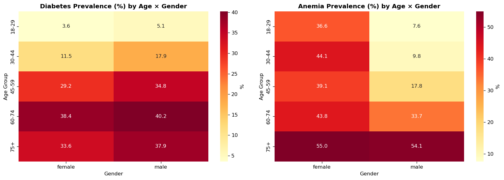

### Disease co-occurrence (pairwise lift)
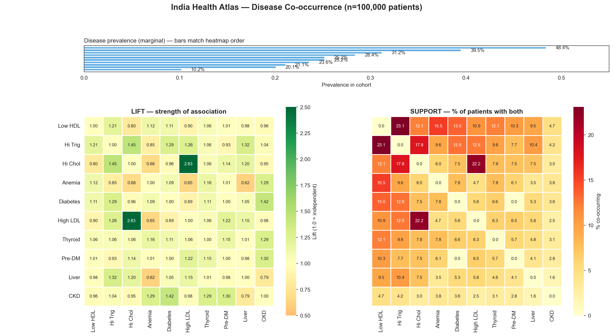

## Results — XGBoost Performance (10 conditions)

The models were trained with strict leakage prevention — lab values that
directly define each label are excluded per condition. Full metrics:
[`data/processed/model_metrics.csv`](data/processed/model_metrics.csv).

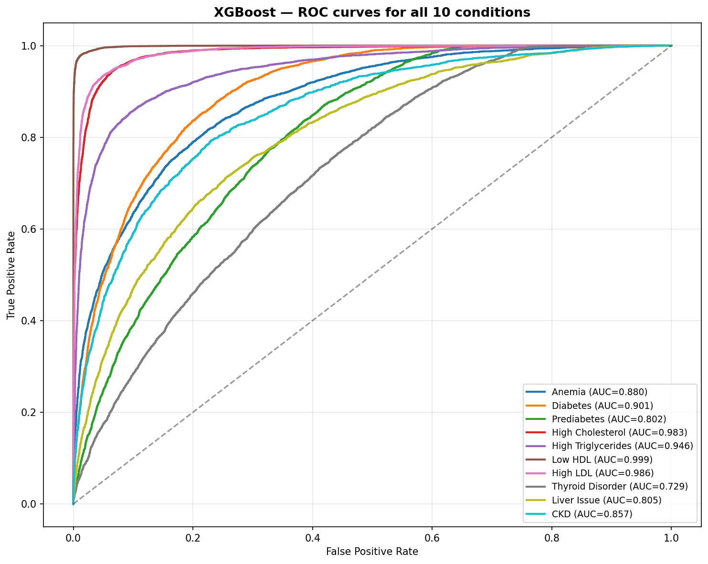

| Condition | AUC | F1 | Prevalence |
|---|---|---|---|
| Low HDL | 0.999 | 0.982 | 48.4% |
| High LDL | 0.986 | 0.892 | 25.2% |
| High Cholesterol | 0.983 | 0.906 | 31.2% |
| High Triglycerides | 0.946 | 0.853 | 39.5% |
| Diabetes | 0.901 | 0.687 | 25.2% |
| Anemia | 0.880 | 0.691 | 28.4% |
| CKD | 0.857 | 0.451 | 10.2% |
| Liver Issue | 0.805 | 0.523 | 20.1% |
| Prediabetes | 0.803 | 0.514 | 21.1% |
| Thyroid Disorder | 0.729 | 0.474 | 23.6% |

## Results — SHAP Explainability

SHAP bar (global feature importance), beeswarm (direction + magnitude), and
waterfall (per-patient explanations) are generated for CKD, Diabetes,
Anemia, and Liver Issue.

| Condition | Global importance | Feature effects | Patient-level |
|---|---|---|---|
| CKD | 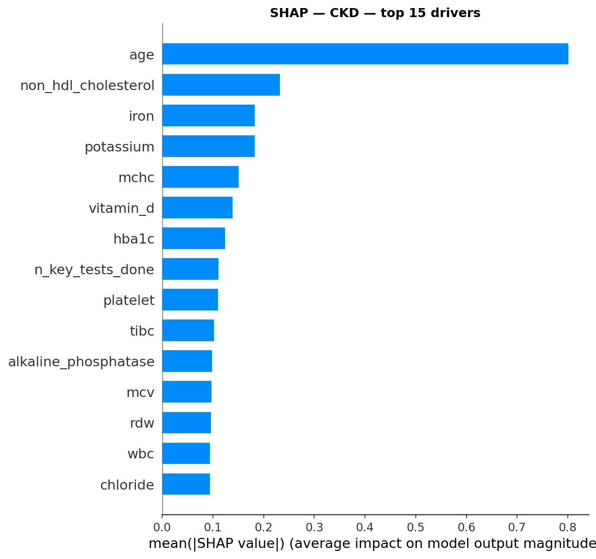 | 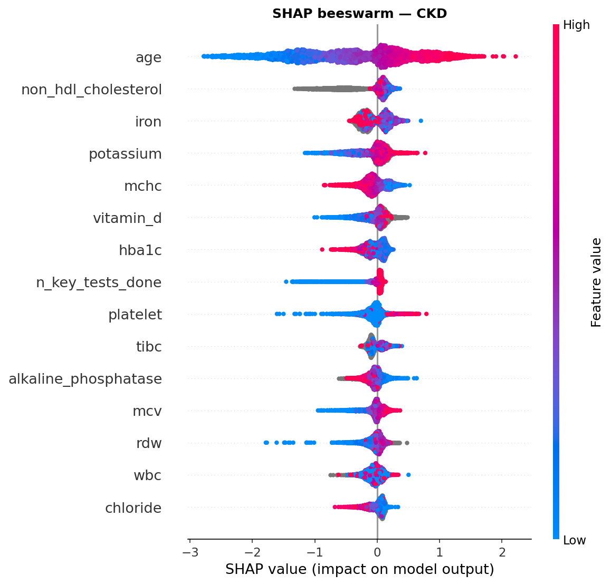 | [Waterfalls](reports/figures/) |
| Diabetes | 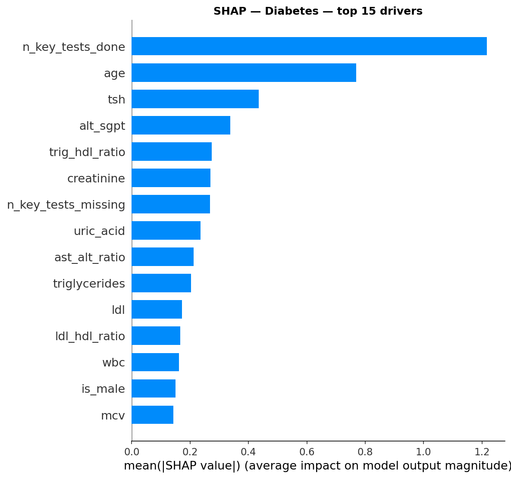 | 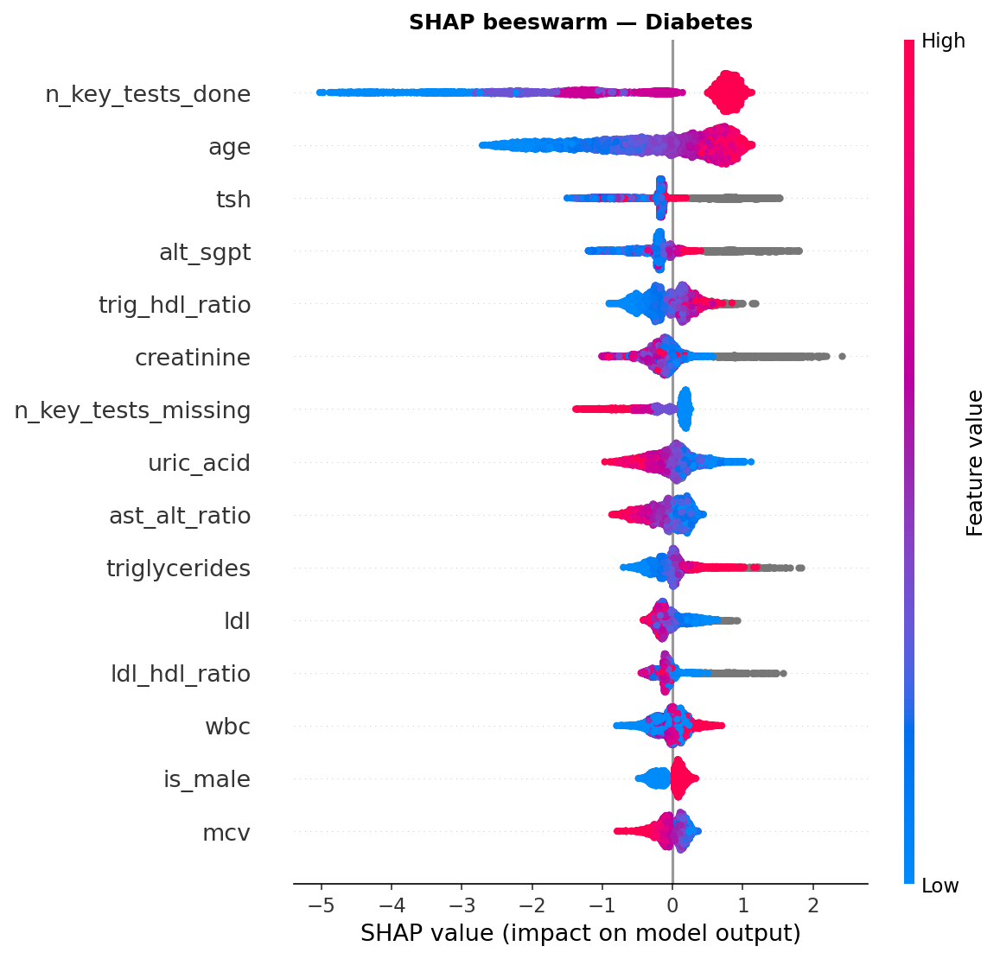 | [Waterfalls](reports/figures/) |
| Anemia | 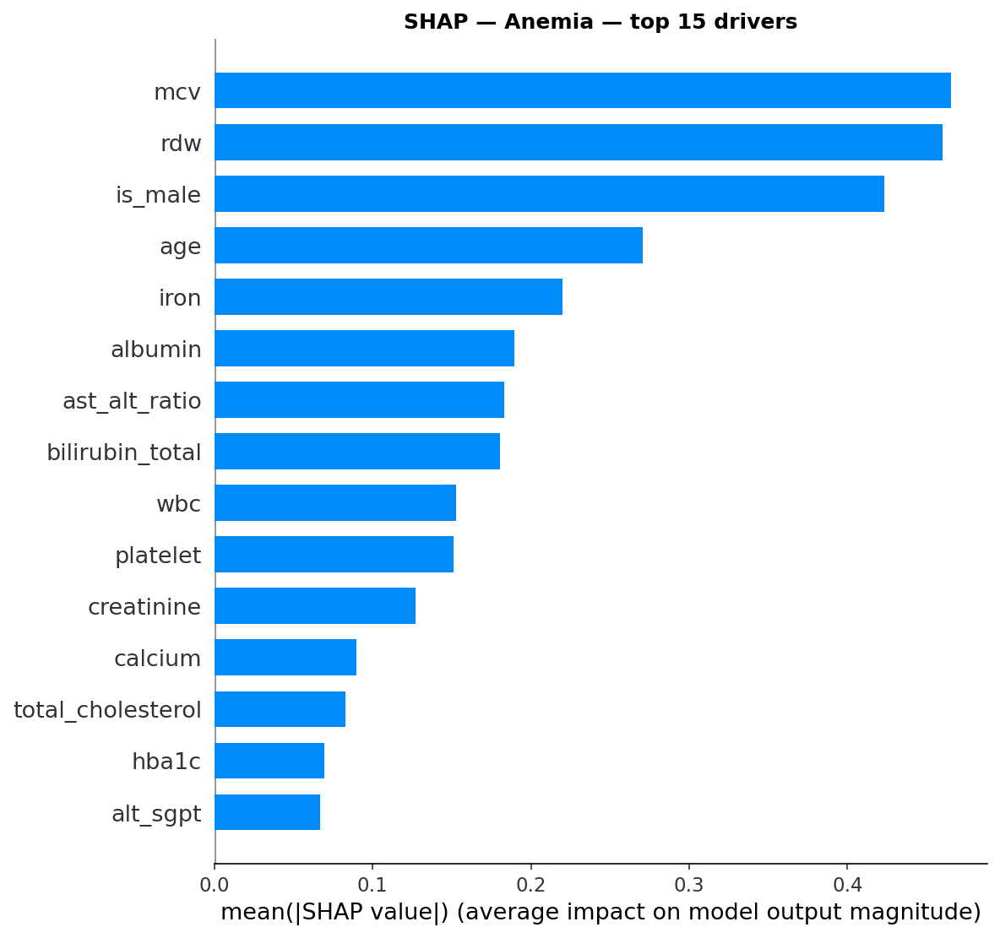 | 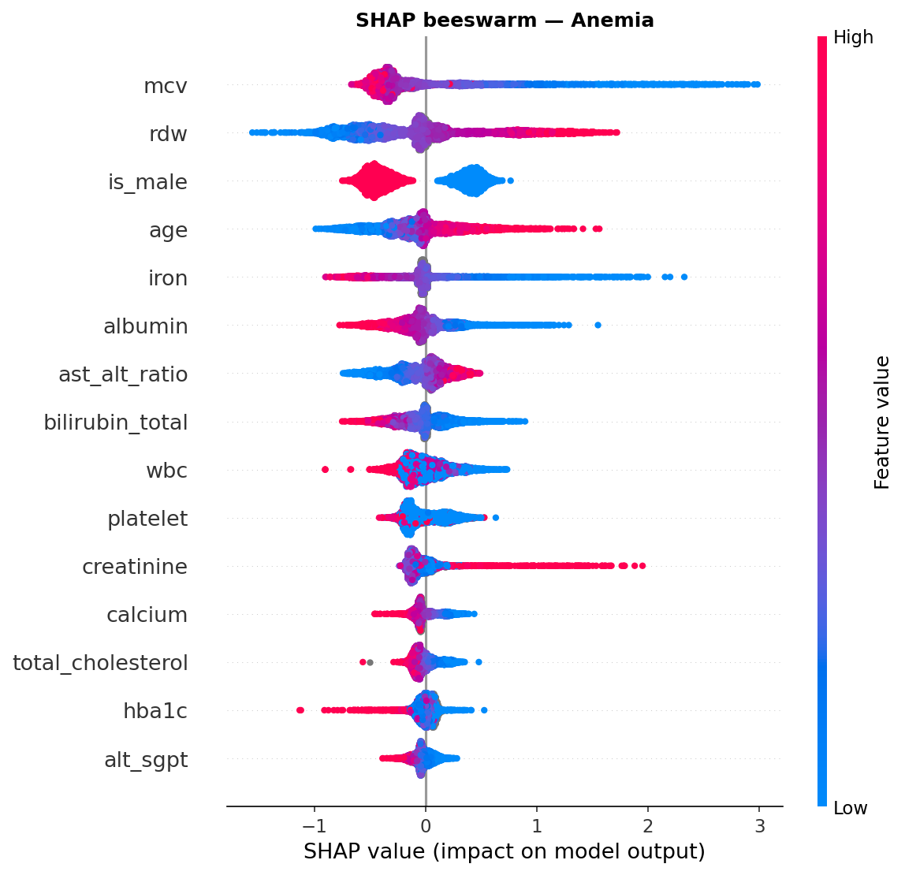 | [Waterfalls](reports/figures/) |
| Liver Issue | 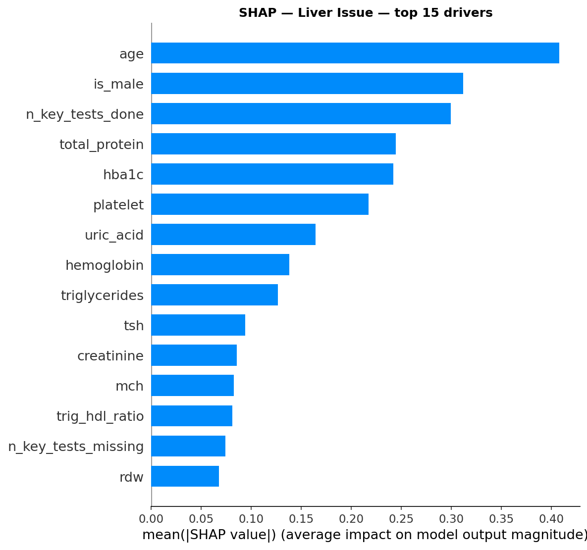 | 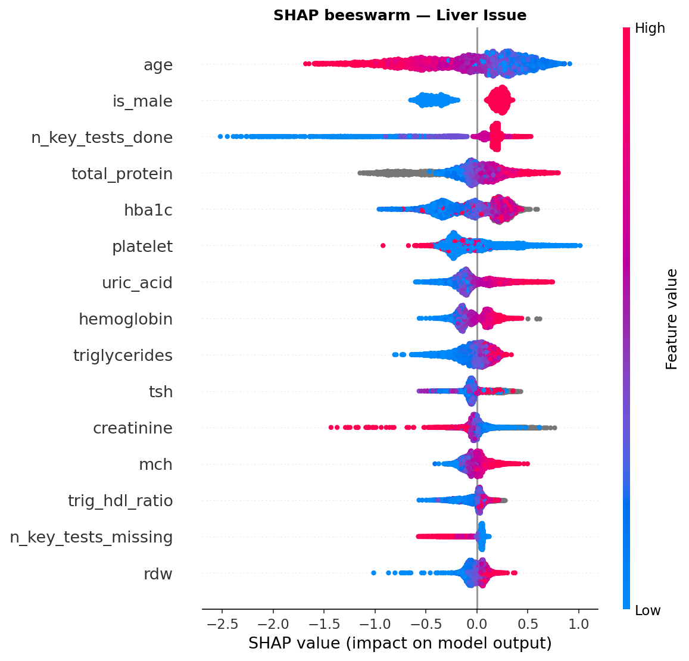 | [Waterfalls](reports/figures/) |

> Full set of per-patient waterfalls:
> `06_shap_waterfall_*_{positive|negative}_case.png` in
> [`reports/figures/`](reports/figures/)

## Lessons & Design Choices

- **Leakage prevention:** models are trained without the defining lab values
  per condition — the fix that corrected an initial AUC=1.0 issue.
- **Subprocess-isolated pipeline:** `run_pipeline.py` runs each phase in a
  separate subprocess to release memory between steps.
- **3-layer lakehouse:** Bronze (parquet) → Silver (DuckDB) → Gold
  (MySQL/CSV). Only curated BI-ready data is exported to Power BI.
- **CSV fallback:** the Power BI build uses CSVs in `data/processed/` for
  maximum portability across environments.

## License

This project is licensed under CC BY-SA 4.0 to match the source dataset.
